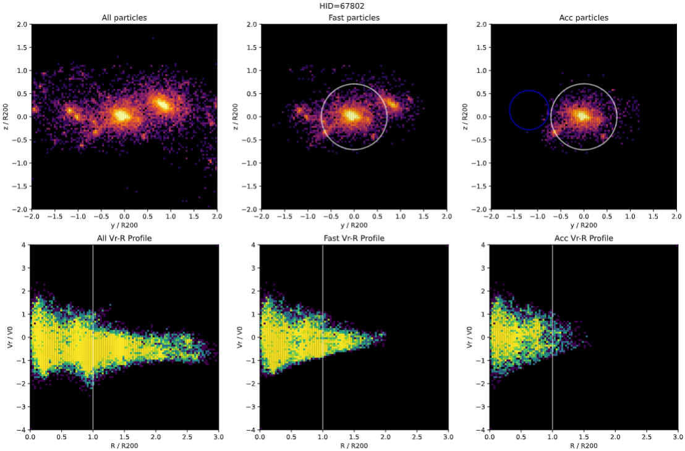

# Halofinder-Dump  

## Overview  
This repository contains a curated selection of code from my research in computational astrophysics, specifically focused on halo finding and analysis in cosmological simulations.  

While the full project remains private due to its ongoing nature and pending publication, this repository serves to highlight a subsection of my algorithm development, data analysis, and coding contributions within a physics-driven computational framework.  

Some scripts in this repository may reference external files that are not included. I have omitted them from this repository to maintain the integrity of the shared contributions that went into them.

---

## Example plotting: Catalog Comparison Visualization
This plot visualizes differences in particles assigned to our computationally cheap, dynamical halofinder (middle plots), and a comparison catalog of halos generated from multi-snapshot data (right plots). Plot generated from halo_visualization_comparison script

---

### Skills & Technologies Demonstrated 
- Python & Data Science: Use of `NumPy`, `SciPy`, `h5py`, `Matplotlib`, and `pandas` for analysis. 
- Optimization: Algorithmic efficiency improvements for large-scale halo catalogs.  
- Big Data Handling: Managing and processing large simulation datasets with HDF5.
- Scientific Computing & Numerical Methods: Efficient handling of large datasets and high-dimensional parameter spaces.  
- Visualization & Statistical Analysis: Creating plots for scientific interpretation of results.  

---

### Contact & Additional Information* 
If you are a recruiter interested in learning more about my contributions, feel free to contact me via Email, GitHub, or LinkedIn for additional context.  

Email: [jhugon@arizona.edu]  
LinkedIn: [www.linkedin.com/in/john-lucas-hugon-581014266]  

---
